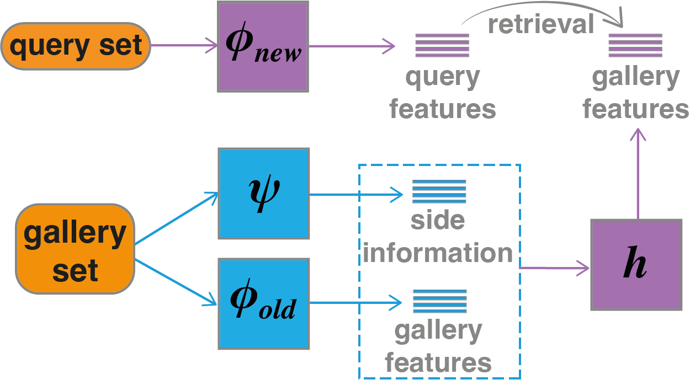

# FCT

- Base on Apple-ml-FCT Changes to the warehouse.
```
Original ownership of the code belongs to 2022 Apple Inc.
Distributed and modified under Apple's open source license.
```
# Simple Use:
* Updata packag/ install
```
  #l use PyTorch version :1.12.0
  $ pip install torch torchvision
  $ pip install tqdm
```
* Download data
```
  python get_dataset.py
```
* Start train ResNet old & new model
```
  python main_New.py # train new model
  python main_Old.py # train old model
```
* Start train Transformations model:
```
  python transformations/main.py
```
